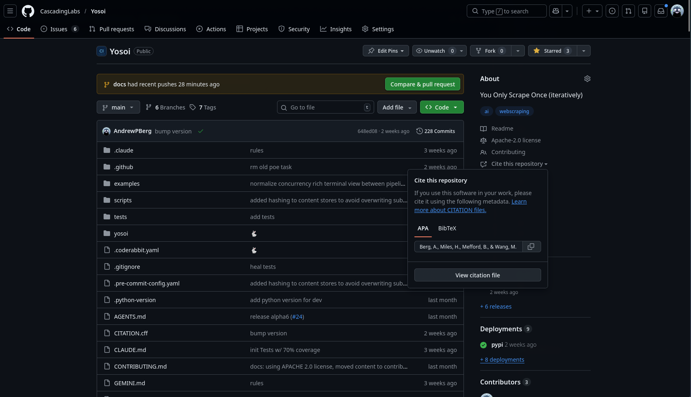

<p align="center">
  <a href="https://cascadinglabs.com/yosoi">
    <picture>
      <source media="(prefers-color-scheme: dark)" srcset="media/logo-dark.svg">
      <source media="(prefers-color-scheme: light)" srcset="media/logo-light.svg">
      
    </picture>
  </a>
</p>

<p align="center">
  <a href="https://discord.gg/YreV3CzxsE"></a>
  <a href="https://opensource.org/licenses/Apache-2.0"></a>
  <a href="https://github.com/CascadingLabs/Yosoi/actions"></a>
  <a href="https://pypi.python.org/pypi/yosoi"></a>
  <a href="https://pypi.python.org/pypi/yosoi"></a>
  <a href="https://codecov.io/gh/CascadingLabs/Yosoi"></a>
  <a href="https://codspeed.io/CascadingLabs/Yosoi"></a>
  <a href="https://doi.org/10.5281/zenodo.18713573"></a>
  <a href="https://cascadinglabs.com/yosoi"></a>
</p>


> [!WARNING]
> **Yosoi is currently in Alpha.** The API is expected to change significantly. We do not expect a stable API until we are out of Beta.

# Yosoi - You Only Scrape Once (iteratively)

> **Discover once, scrape forever**

> [!WARNING]
> Yosoi is research tooling for API design and web reverse engineering. **You assume all legal risk for how you use it.** Respect `robots.txt`, rate limits, and IP bans; and please don't bypass them with Tor or a VPN. Read [DISCLAIMER.md](DISCLAIMER.md) before pointing it at anything.

Give Yosoi a URL, domain, or group of URLs, and it uses AI to automatically discover the best selectors for structured content.

## Installation

```bash
# Install yosoi using uv
uv add yosoi
```

## Browser Fetcher (JavaScript-heavy pages)

Yosoi supports a browser-based HTML fetcher powered by [void_crawl](https://github.com/CascadingLabs/Void-Crawl) — a Rust-native CDP client that renders JavaScript-heavy pages via Chrome DevTools Protocol.

Install `void_crawl` from the [Void-Crawl repo](https://github.com/CascadingLabs/Void-Crawl) (requires Rust ≥ 1.86, maturin ≥ 1.7, Chrome/Chromium), then use it via the `create_fetcher` API or the `yosoi.vc` convenience module:

```python
# Fetcher interface
from yosoi.core.fetcher import create_fetcher

async def scrape():
    fetcher = create_fetcher("browser", no_sandbox=True)
    async with fetcher:
        result = await fetcher.fetch("https://example.com")
        print(result.html)
```

```python
# vc convenience module — pool-based (recommended)
from yosoi import vc

async def scrape():
    async with vc.pool() as pool:
        async with await pool.acquire() as tab:
            await tab.navigate("https://example.com")
            html = await tab.content()
```

See [`examples/README.md`](examples/README.md) for the maintained example set. For the explainable page-fingerprinting stack behind resilient reuse, see [`docs/fingerprinting-stack.md`](docs/fingerprinting-stack.md).

## Portable recipes

Recipes package a contract, verified selectors, optional A3Node browser actions, and validation evidence into deterministic JSON for review and replay:

```bash
uv run yosoi recipe mint --contract @Product --from-cache https://example.com/product/1 --out .yosoi/recipes/ --yes
uv run yosoi recipe validate .yosoi/recipes/product.recipe.json --url https://example.com/product/1 --write
uv run yosoi scrape https://example.com/product/2 --recipe .yosoi/recipes/product.recipe.json --recipe-id v1:sha256:...
```

Remote recipes are pin-required and trust-gated. See [`docs/recipes.md`](docs/recipes.md).

## Agent workflows

Install Yosoi fetch/search/crawl/research skills into supported coding agents:

```bash
uvx yosoi agents install --target pi
uvx yosoi agents install --target agents
```

See [`docs/agent-workflows.md`](docs/agent-workflows.md). For direct, bounded multi-URL page acquisition, see [`docs/fetch.md`](docs/fetch.md).

## Quick Start

### API Key
Export your API Key or create a `.env` file
```bash
# Set keys for whichever providers you want to use
<PROVIDER_NAME>_KEY=your_api_key_here
GROQ_API_KEY=your_groq_key_here               # groq/...
GEMINI_API_KEY=your_gemini_api_key_here       # gemini/...
OPENAI_API_KEY=your_openai_api_key_here       # openai/...
CEREBRAS_API_KEY=your_cerebras_api_key_here   # cerebras/...
OPENROUTER_API_KEY=your_openrouter_key_here  # openrouter/...
```

See the full list of [supported providers](https://cascadinglabs.com/reference/helpers/)


### Basic Usage

#### CLI Usage
```sh
# Specify model explicitly with -m provider:model-name
uv run yosoi -m groq:llama-3.3-70b-versatile --url https://qscrape.dev/l1/eshop/catalog/?cat=Forge%20%26%20Smithing --contract Product
```
You can then find your scraped content, selectors and logs in `./.yosoi` relative to the directory you run the CLI command from.

#### Python Usage
We also have example scripts, you can find them in our [example docs](https://cascadinglabs.com/guides/examples/)

## Citation

If you use **yosoi** in your research or projects, please cite it using the metadata provided in the `CITATION.cff` file.


<p align="center">
    
</p>

## Community

- **Responsible use:** see [DISCLAIMER.md](DISCLAIMER.md)

## Contact

[contact@cascadinglabs.com](mailto:contact@cascadinglabs.com)
